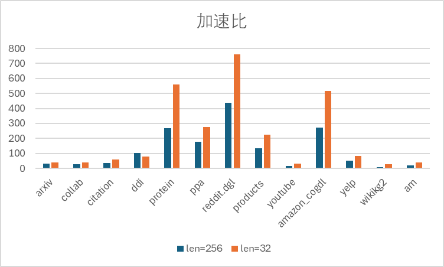

# 实验三：稀疏矩阵-矩阵乘

THU 2024春高性能计算导论 PA3

## 实现方法

我的代码如下：

```cpp
#include "spmm_opt.h"
#include <vector>
#include <algorithm>

#define X_BLOCK_SIZE 32
#define Y_BLOCK_SIZE 32
#define BLOCK_SIZE (X_BLOCK_SIZE * Y_BLOCK_SIZE)

#define TARGET_SIZE 256

inline int ceiling(int a, int b) { return (a + b - 1) / b; }

// 做负载均衡的实现
__global__ void spmm_kernel_opt(int *ptr, int *idx, float *val, float *vin, float *vout, int num_v, int feat_in, int num_target, int *target, int *ptr_scheduled)
{
    __shared__ int s_idx[X_BLOCK_SIZE][Y_BLOCK_SIZE];
    __shared__ float s_val[X_BLOCK_SIZE][Y_BLOCK_SIZE];

    const int t_x = threadIdx.x / Y_BLOCK_SIZE;
    const int t_y = threadIdx.x % Y_BLOCK_SIZE;
    const int my_target = blockIdx.x * X_BLOCK_SIZE + t_x;

    if (my_target >= num_target)
        return;

    const int x = __ldg(&ptr_scheduled[my_target]);
    const int y = blockIdx.y * Y_BLOCK_SIZE + t_y;
    const int beg = __ldg(&target[my_target]);
    const int end = __ldg(&target[my_target + 1]);

    const float *offset_pos = vin + y;
    float sum = 0.0f;

    for (int i = beg; i < end; i += Y_BLOCK_SIZE)
    {
        const int rank = i + t_y;
        if (rank < end)
        {
            s_idx[t_x][t_y] = __ldg(&idx[rank]);
            s_val[t_x][t_y] = __ldg(&val[rank]);
        }
        else
        {
            s_idx[t_x][t_y] = 0;
            s_val[t_x][t_y] = 0.0f;
        }
        __syncthreads();
        if (y < feat_in)
            for (int j = 0; j < Y_BLOCK_SIZE; ++j)
                sum += s_val[t_x][j] * __ldg(offset_pos + (s_idx[t_x][j] * feat_in));
        __syncthreads();
    }

    if (y < feat_in)
        atomicAdd(&vout[x * feat_in + y], sum);
}

void SpMMOpt::edgesort()
{
    int *h_ptr = (int *)malloc(sizeof(int) * (num_v + 1));
    int *h_idx = (int *)malloc(sizeof(int) * num_e);
    float *h_val = (float *)malloc(sizeof(float) * num_e);
    checkCudaErrors(cudaMemcpy(h_ptr, d_ptr, sizeof(int) * (num_v + 1), cudaMemcpyDeviceToHost));
    checkCudaErrors(cudaMemcpy(h_idx, d_idx, sizeof(int) * num_e, cudaMemcpyDeviceToHost));
    checkCudaErrors(cudaMemcpy(h_val, d_val, sizeof(float) * num_e, cudaMemcpyDeviceToHost));
    for (int i = 0; i < num_v; i++)
    {
        std::vector<std::pair<int, float>> edges;
        for (int j = h_ptr[i]; j < h_ptr[i + 1]; j++)
            edges.push_back(std::make_pair(h_idx[j], h_val[j]));
        std::sort(edges.begin(), edges.end());
        for (int j = h_ptr[i]; j < h_ptr[i + 1]; j++)
        {
            h_idx[j] = edges[j - h_ptr[i]].first;
            h_val[j] = edges[j - h_ptr[i]].second;
        }
    }
    checkCudaErrors(cudaMemcpy(d_idx, h_idx, sizeof(int) * num_e, cudaMemcpyHostToDevice));
    checkCudaErrors(cudaMemcpy(d_val, h_val, sizeof(float) * num_e, cudaMemcpyHostToDevice));
    free(h_ptr);
    free(h_idx);
    free(h_val);
}

void SpMMOpt::neighbor_grouping(int neighbor_num)
{
    int *h_ptr = (int *)malloc(sizeof(int) * (num_v + 1));
    checkCudaErrors(cudaMemcpy(h_ptr, d_ptr, sizeof(int) * (num_v + 1), cudaMemcpyDeviceToHost));
    vector<int> t_ptr, t_rnk;
    for (int x = 0; x < num_v; ++x)
    {
        int begin = h_ptr[x], end = h_ptr[x + 1];
        for (int rnk = begin; rnk < end; rnk += neighbor_num)
        {
            t_ptr.push_back(x);
            t_rnk.push_back(rnk);
        }
    }
    t_rnk.push_back(num_e);
    num_target = t_ptr.size();
    checkCudaErrors(cudaMalloc(&ptr_scheduled, sizeof(int) * num_target));
    checkCudaErrors(cudaMalloc(&target, sizeof(int) * (num_target + 1)));
    checkCudaErrors(cudaMemcpy(ptr_scheduled, t_ptr.data(), sizeof(int) * num_target, cudaMemcpyHostToDevice));
    checkCudaErrors(cudaMemcpy(target, t_rnk.data(), sizeof(int) * (num_target + 1), cudaMemcpyHostToDevice));
    free(h_ptr);
}

void SpMMOpt::preprocess(float *vin, float *vout)
{
    edgesort();
    neighbor_grouping(TARGET_SIZE);
    checkCudaErrors(cudaMemset(vout, 0, sizeof(float) * num_v * feat_in));

    // 做负载均衡的分块
    block.x = BLOCK_SIZE;
    block.y = 1;
    block.z = 1;
    grid.x = ceiling(num_target, X_BLOCK_SIZE);
    grid.y = ceiling(feat_in, Y_BLOCK_SIZE);
    grid.z = 1;
}

void SpMMOpt::run(float *vin, float *vout)
{
    spmm_kernel_opt<<<grid, block>>>(d_ptr, d_idx, d_val, vin, vout, num_v, feat_in, num_target, target, ptr_scheduled);
}

SpMMOpt::~SpMMOpt(){
    checkCudaErrors(cudaFree(ptr_scheduled));
    checkCudaErrors(cudaFree(target));
    num_target = 0;
}
```

1. 解决 warp divergence 问题

我改变了配任务的方式，每一个线程都映射到 `vout` 的一个坐标 $(x, y)$，然后这个线程就负责读取稀疏矩阵的第 $x$ 行和稠密矩阵的第 $y$ 列对应的元素，然后把结果加到 `vout[x][y]` 中。

由于相邻的线程都要读取稀疏矩阵的第 $x$ 行，只是匹配到了稠密矩阵的不同列，因而它们的工作量是相近的。

2. 利用缓存

由于相邻的线程都要读取稀疏矩阵的第 $x$ 行，还可以在共享内存中同步稀疏矩阵第 $x$ 行的元素，不用让每个线程都把第 $x$ 行完整地读一遍。

通过查资料我还了解了 `__ldg` 函数可以跳过缓存直接加载全局内存的数据。由于使用了共享内存，一个线程只读一处全局内存，使用 `__ldg` 函数可以提高读取速度。

3. 改善数据的局部性

稀疏矩阵每一行的数据似乎是没按顺序排布的，所以我实现了 `SpMMOpt` 中原先没有实现的 `edgesort` 方法，将每一行的边按照列的顺序排序了。

4. 解决 load imbalance 的问题

大部分的稀疏矩阵都是不规则的，有的行近乎没有元素，有点行有成百上千个元素。对于后者，我安排了更多的线程块去处理。这样，线程块之间的差距就不大了。

我实现了 `SpMMOpt` 中原先没有实现的 `neighbor_grouping` 方法，并且利用了原先没有用的 `num_target`，`target` 和 `ptr_scheduled` 这三个变量，细化了线程块处理的力度。

具体来说，我设置了一个线程块处理的最多列元素数 `TARGET_SIZE`，如果稀疏矩阵的某一行元素数多于 `TARGET_SIZE`，我就按照 `TARGET_SIZE` 将这一列分成几个 target。对于每个 target，我在 `ptr_scheduled` 中存储了它的 $x$ 坐标，在 `target` 数组中存了它涉及的元素范围。

这样的划分有两个好处：（1）设定了一个线程块处理的最大工作量，将比较稠密的行分配给多个线程块；（2）同时也隐含地将最小工作量从 0 变成 1，这样可以直接跳过没有元素的行，在某些特殊的矩阵上会有很好的效果。

## 不同优化对性能的影响

在我实现的四种优化中，第一种和第四种有比较大的性能提升，第二种和第三种提升不大，这里我就着重测试一下提升比较大的两个优化的效果。

1. 解决 warp divergence 的性能提升

让 `spmm_opt` 不做 `neighbor_grouping`（即，直接分配一整行任务，也不跳过没有元素的行），和 `spmm_ref` 对比，就可以体现出重新分块的效果。

在 ddi 数据集上测试，对比如下。

`spmm_ref`：

```sh
2021011145@conv0:~/PA3/build$ srun -N 1 --gres=gpu:1 ./test/unit_tests --dataset ddi --len 256 --datadir ~/PA3/data/
[..1145/PA3/src/util.cu:74 (argParse)] dset = "ddi" (std::string)
[..1145/PA3/src/data.cu:5 (load_graph)] loading
[..45/PA3/test/main.cpp:17 (main)] kLen = 256 (int)
[==========] Running 3 tests from 1 test suite.
[----------] Global test environment set-up.
[----------] 3 tests from SpMMTest
[ RUN      ] SpMMTest.validation
[       OK ] SpMMTest.validation (214 ms)
[ RUN      ] SpMMTest.cusparse_performance
[..A3/test/test_spmm.cu:62 (TestBody)] time = 0.00155959 (double)
[       OK ] SpMMTest.cusparse_performance (259 ms)
[ RUN      ] SpMMTest.opt_performance
[..A3/test/test_spmm.cu:71 (TestBody)] time = 0.0976882 (double)
[       OK ] SpMMTest.opt_performance (2933 ms)
[----------] 3 tests from SpMMTest (3407 ms total)

[----------] Global test environment tear-down
[==========] 3 tests from 1 test suite ran. (3407 ms total)
[  PASSED  ] 3 tests.
```

`spmm_opt`（naive 版本）：

```sh
2021011145@conv0:~/PA3/build$ srun -N 1 --gres=gpu:1 ./test/unit_tests --dataset ddi --len 256 --datadir ~/PA3/data/
[..1145/PA3/src/util.cu:74 (argParse)] dset = "ddi" (std::string)
[..1145/PA3/src/data.cu:5 (load_graph)] loading
[..45/PA3/test/main.cpp:17 (main)] kLen = 256 (int)
[==========] Running 3 tests from 1 test suite.
[----------] Global test environment set-up.
[----------] 3 tests from SpMMTest
[ RUN      ] SpMMTest.validation
[       OK ] SpMMTest.validation (161 ms)
[ RUN      ] SpMMTest.cusparse_performance
[..A3/test/test_spmm.cu:62 (TestBody)] time = 0.00155389 (double)
[       OK ] SpMMTest.cusparse_performance (250 ms)
[ RUN      ] SpMMTest.opt_performance
[..A3/test/test_spmm.cu:71 (TestBody)] time = 0.00169443 (double)
[       OK ] SpMMTest.opt_performance (110 ms)
[----------] 3 tests from SpMMTest (523 ms total)

[----------] Global test environment tear-down
[==========] 3 tests from 1 test suite ran. (523 ms total)
[  PASSED  ] 3 tests.
```

可以看到明显的性能提升。

2. 解决 load imbalance 的性能提升

在 am 数据集上对比不做 `neighbor_grouping` 的代码和做 `neighbor_grouping` 的代码，结果如下。

不做 `neighbor_grouping`：

```sh
2021011145@conv0:~/PA3/build$ srun -N 1 --gres=gpu:1 ./test/unit_tests --dataset am --len 256 --datadir ~/PA3/data/
[..1145/PA3/src/util.cu:74 (argParse)] dset = "am" (std::string)
[..1145/PA3/src/data.cu:5 (load_graph)] loading
[..45/PA3/test/main.cpp:17 (main)] kLen = 256 (int)
[==========] Running 3 tests from 1 test suite.
[----------] Global test environment set-up.
[----------] 3 tests from SpMMTest
[ RUN      ] SpMMTest.validation
[       OK ] SpMMTest.validation (5226 ms)
[ RUN      ] SpMMTest.cusparse_performance
[..A3/test/test_spmm.cu:62 (TestBody)] time = 0.0133828 (double)
[       OK ] SpMMTest.cusparse_performance (663 ms)
[ RUN      ] SpMMTest.opt_performance
[..A3/test/test_spmm.cu:71 (TestBody)] time = 0.0368786 (double)
[       OK ] SpMMTest.opt_performance (1427 ms)
[----------] 3 tests from SpMMTest (7317 ms total)

[----------] Global test environment tear-down
[==========] 3 tests from 1 test suite ran. (7317 ms total)
[  PASSED  ] 3 tests.
```

做 `neighbor_grouping`：

```sh
2021011145@conv0:~/PA3/build$ srun -N 1 --gres=gpu:1 ./test/unit_tests --dataset am --len 256 --datadir ~/PA3/data/
[..1145/PA3/src/util.cu:74 (argParse)] dset = "am" (std::string)
[..1145/PA3/src/data.cu:5 (load_graph)] loading
[..45/PA3/test/main.cpp:17 (main)] kLen = 256 (int)
[==========] Running 3 tests from 1 test suite.
[----------] Global test environment set-up.
[----------] 3 tests from SpMMTest
[ RUN      ] SpMMTest.validation
[       OK ] SpMMTest.validation (5064 ms)
[ RUN      ] SpMMTest.cusparse_performance
[..A3/test/test_spmm.cu:62 (TestBody)] time = 0.0133799 (double)
[       OK ] SpMMTest.cusparse_performance (658 ms)
[ RUN      ] SpMMTest.opt_performance
[..A3/test/test_spmm.cu:71 (TestBody)] time = 0.00069647 (double)
[       OK ] SpMMTest.opt_performance (372 ms)
[----------] 3 tests from SpMMTest (6096 ms total)

[----------] Global test environment tear-down
[==========] 3 tests from 1 test suite ran. (6096 ms total)
[  PASSED  ] 3 tests.
```

性能的提升也很明显。

## 运行时间

运行时间的测试结果如下。

$len = 32$ 时：

| 数据集       | spmm_cusparse用时(us) | spmm_opt用时(us) | 加速比   |
| ------------ | ---------------------- | ----------------- | -------- |
| arxiv        | 773.577                | 1.89E+01          | 41.00333 |
| collab       | 1335.24                | 3.28E+01          | 40.69018 |
| citation     | 16446.8                | 2.79E+02          | 58.85376 |
| ddi          | 639.819                | 7.97E+00          | 80.30613 |
| protein      | 24673.5                | 4.41E+01          | 559.3059 |
| ppa          | 18379.9                | 6.65E+01          | 276.2428 |
| reddit.dgl   | 48547.4                | 6.38E+01          | 761.0837 |
| products     | 55862.9                | 2.48E+02          | 225.1892 |
| youtube      | 3643.97                | 1.18E+02          | 30.77028 |
| amazon_cogdl | 125364                 | 2.42E+02          | 517.725  |
| yelp         | 6573.99                | 7.78E+01          | 84.51477 |
| wikikg2      | 7140.6                 | 2.49E+02          | 28.68206 |
| am           | 3741.63                | 9.28E+01          | 40.30912 |

$len = 256$ 时：

| 数据集       | spmm_cusparse用时(us) | spmm_opt用时(us) | 加速比   |
| ------------ | ---------------------- | ----------------- | -------- |
| arxiv        | 2994.02                | 9.10E+01          | 32.899   |
| collab       | 5203.16                | 1.90E+02          | 27.36748 |
| citation     | 79029                  | 2.19E+03          | 36.14473 |
| ddi          | 1553.52                | 1.50E+01          | 103.3854 |
| protein      | 80802.8                | 3.03E+02          | 266.6953 |
| ppa          | 84887.6                | 4.81E+02          | 176.4573 |
| reddit.dgl   | 202324                 | 4.61E+02          | 438.4926 |
| products     | 258426                 | 1.93E+03          | 133.568  |
| youtube      | 14428.8                | 8.95E+02          | 16.12461 |
| amazon_cogdl | 517735                 | 1.89E+03          | 273.6414 |
| yelp         | 29990.4                | 5.72E+02          | 52.402   |
| wikikg2      | 16631.3                | 1.95E+03          | 8.541882 |
| am           | 13379.9                | 6.96E+02          | 19.21102 |

加速比的对比如图：



整体加速比都挺不错，因为 `neighbor_grouping` 的设计，在 `am` 和 `arxiv` 上也会有不错的表现。

随着数据规模的增加，加速比会受一定影响。我认为这是因为我的优化主要是处理稀疏矩阵，没有考虑到稠密矩阵，而 $len$ 扩展的是稠密矩阵。

## 参考

我的分块方案参考了以下仓库：

https://github.com/Guangxuan-Xiao/SPMM-CUDA/tree/master